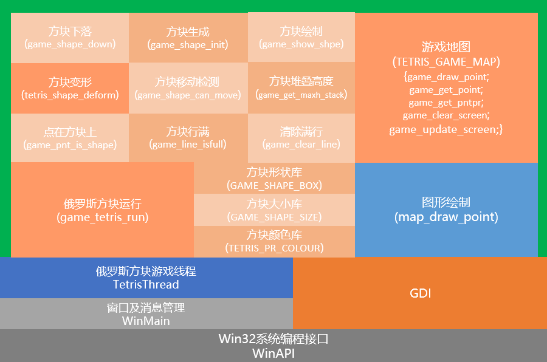
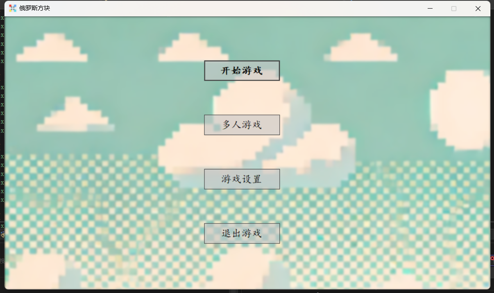
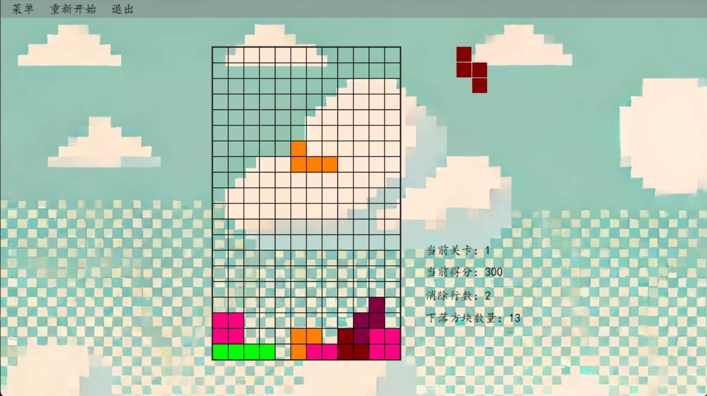

# 基于sdk实现的俄罗斯方块

本程序是一个基于Windows桌面环境的俄罗斯方块游戏。它由三个主要的组件构成：主控制模块（Main.cpp），游戏逻辑模块（Tetris.cpp），和图形绘制接口模块（Gdi.cpp）。这些模块相互作用，以提供游戏的全部功能，包括用户交互、游戏状态管理、图形显示和输入处理。

- 主控制模块：负责程序的初始化，窗口创建，消息循环的处理，以及启动游戏线程。
- 游戏逻辑模块：处理游戏的核心逻辑，如形状的生成、移动、旋转，以及行的清除和得分计算。
- 图形绘制接口模块：提供基础的图形绘制功能，如画点、画线、画形状等，并管理画面的更新。（双缓冲技术的实现）

代码框架如下图所示：

运行结果如下：

